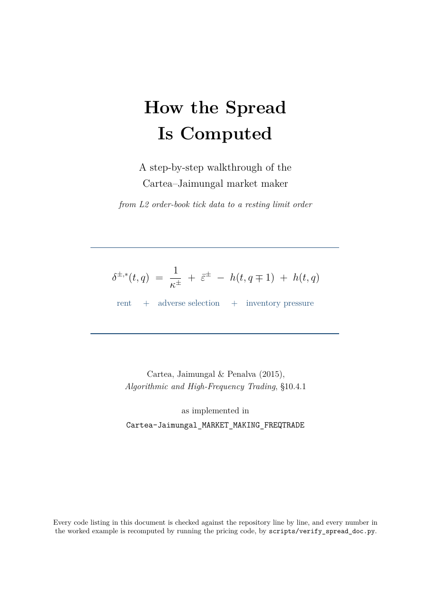

# Cartea–Jaimungal Market Making on Hyperliquid

A market maker implementing the Cartea–Jaimungal–Penalva model (Chapter 10 of
*Algorithmic and High-Frequency Trading*, 2015) with real-time parameter
estimation, as a **standalone Rust runtime** plus a Python replay and
calibration toolchain. **Works ONLY for Hyperliquid.**

> **The Freqtrade implementation is retired.** This project began as a Freqtrade
> strategy; that trader — two cooperating legs, a parameter-estimator sidecar and
> a Redis snapshot bus — was removed on 2026-08-25 and is recoverable in full at
> the tag **`freqtrade-trader-final`**. What replaced it is `rust_live/`. The
> Python here is now replay, sweeps, estimators and the data collector: the
> measurement half of the project, not the trading half.

<p align="center">
  <a href="docs/spread_calculation.pdf">
    
  </a>
</p>

<p align="center">
  <b><a href="docs/spread_calculation.pdf">📄 How the Spread Is Computed</a></b><br>
  <sub>A beginner-friendly walkthrough: what the book says, the Python that
  implements it, and a fully worked example from L2 tick data to a resting order.<br>
  Every listing is checked against the source and every number recomputed by
  <a href="scripts/verify_spread_doc.py"><code>verify_spread_doc.py</code></a>.</sub>
</p>

---

## ⚠️ Read this before running it with real money

**The goal of this project is a faithful implementation of the Cartea–Jaimungal
method, not a competitive trading strategy. It is not expected to be profitable
as deployed, and measurement says it is not.**

**The cadence constraint is gone; the economics did not follow.** The retired
Freqtrade loop requoted at a measured p50 of 5.5 s — three to five orders of
magnitude slower than the venue moves — and that was the headline objection to
this stack for most of its life. `rust_live/` removed it: the hot decision path
measures **p99 = 0.02 ms**, against 150 ms of *simulated* latency in replay, so
compute now sits four orders of magnitude below the network. What remains is
network distance and the venue's own limits, and neither is what the model was
losing to. Adverse selection was, and still is: measured, it roughly **doubles**
between a 200 ms and a 5 s markout (ε went 1.98→3.98 bps on the ask, 3.53→6.14
bps on the bid).

**What the live grid says now.** An 18-variant dry-run grid runs continuously
against one shared feed (`docs/DRY_RUN_GRID.md`). Its one stable result across
every checkpoint of a nine-hour run: **every rung at or below 8 bps half-spread
loses, and every rung at or above 16 bps is positive.** Fill count runs cleanly
inverse to P&L — the winner takes a few hundred fills, the worst take two to
three thousand. The finer ordering among the wide rungs is *not* established and
reversed three times inside a single run; that file carries the whole series so
the next reader does not extract a ranking from one timestamp.

**The loss is one window, not a steady bleed.** The current evidence is a
staged parameter sweep on a pinned **161.95 h** CASHCAT tape (918,417 price
rows, 417,923 trades, 0.7 train/held-out split) — `docs/cashcat_sweep.md`. It
replaces a 95.23 h run whose headline conclusions did **not** survive the extra
70% of tape; that earlier artifact is kept as
`docs/cashcat_sweep_20260820_95h.*` for comparison.

- **One six-hour window is the entire result.** The winner scores −205.89 USDC
  across 27 windows, but the window at `08-22 03:57` alone is **−241.17** on
  1,771 fills. Excluding it the same run is **+35.28 over 26 windows**. That one
  window is 117% of the total loss and 40% of every fill taken.
- **So the shape is fat-tailed, not marginal.** 13 of 27 windows are positive,
  and the failure mode is a volume burst: the busiest window is the losing one,
  and it takes more fills than the next twelve windows combined.
- **The latency ladder inverted.** On 95 h the colocated rung was the only
  positive one (+23.07) and the story was "latency is economically decisive".
  On 162 h colocated is the **worst** rung: colocated (50 ms/100 ms) −418.11,
  good (100/250) −279.11, mid (200/500) −388.59, this stack (500/1000) −398.20,
  slow-refresh reality (500 ms/30 s) **+9.36**. Quoting faster means taking more
  of the burst, so speed made the tail worse rather than better. Do not quote
  the old ladder.
- **The spread is earned; the direction gives it back.** At 100 ms the net
  realized spread after fees is +852.51 USDC against −1,131.62 of
  directional/adverse P&L. In the losing window alone: +683.89 spread against
  −925.05 directional.

**That one window is now guarded.** `docs/TOXIC_FLOW_GUARD.md` covers the
toxic-flow guard built against it — a fast mid-move breaker plus VPIN — which on
a frozen replay of the cascade cut the loss 74% (−87.95 → −23.13, re-baselined
in `docs/FLOW_GUARD_CANDIDATES.md`) and bounded ending inventory, while being
bit-identical on a calm control window. It does not predict the crash; it
bounds how much of one gets ridden down, and both legs still lose money. Four
candidate improvements to the guard were then studied on 165 h of frozen tape
(`docs/FLOW_GUARD_CANDIDATES.md`): all four rejected or deferred — including
the counter-intuitive result that a spread gate firing 46 minutes *earlier*
made the crash 3.8x *worse*, because withdrawing quotes freezes inventory
instead of de-risking it.

The practical reading: a short tape can invert this conclusion, so every sweep
must run on the maximum tape available (`docs/DATA_COLLECTION.md` covers how the
tape is produced and how far back it goes).
- **Performance is unstable across time.** Only 5/16 held-out windows are
  positive. The same selected configuration ranges from +7.63 to −13.55 USDC
  over six-hour windows despite 1,135 held-out maker fills in aggregate.
- Stage A, which holds the risk knobs at the strategy default
  `hjb_phi_kappa_t = 10`, loses on **all 81 calibrations**, on every tape measured.

`docs/replay_acceptance_report.*` is an older 24-minute fail-closed gate smoke
with `ok=false`; it is retained as evidence but must not be mistaken for the
95-hour staged sweep above.

**Real money has since been risked, twice.** `docs/live_canary_20260823.md`
records two mainnet CASHCAT sessions at minimum size: what they cost, the three
production defects they surfaced, and why the venue's **address-action budget**
— a lifetime account allowance of `10,000 + 1 per USDC traded` that never
resets — is the constraint that actually binds this strategy, ahead of the
WebSocket message rate the configuration validates against.

`docs/latency_hysteresis_sweep.md` crosses simulated latency (50/100/200/500 ms)
with the requote hold window on one frozen two-hour window. It resolves the
**address-action cost** cleanly — `bps = 4` buys ~2.2x the runtime per unit of
venue allowance that the shipped `bps = 2` does — but it is explicit that a
two-hour window at ~50 fills **cannot** resolve latency economics, and that the
95-hour ladder above remains the evidence for those.

Market data is produced by a Docker container, not by this repo; see
`docs/DATA_COLLECTION.md` for who owns the tape, why no live session can
disturb it, and how to check that it is still running.

Shorter tapes read positive out of sample — +1.18 on 24.8 h, +1.56 on 31.23 h
(`docs/cashcat_sweep_phitail.md`), +1.37 on 44.97 h — while both the 60.32 h and
95.23 h tapes read negative. The winning calibration also moved between tapes,
so nothing here supports a claim of calibration stability. The later Rust
direct-window replay independently lost 17.43 USDC over 112 fills and showed
positive 100 ms markout turning sharply negative by 1–30 seconds.

**If you intend to trade this seriously you need a co-located VPS** — an AWS
instance in the region nearest the exchange (Tokyo is the usual choice for
Hyperliquid), on a low-latency link, with the quoting loop rewritten to requote
in milliseconds rather than on a candle cadence. **And even that may not be
enough.** Competitive market making on a 20 bps spread is a latency race against
firms with dedicated infrastructure; nothing here has been shown to win it.

Use this to understand and verify the model. Treat any profit as unproven.

---

## Overview

Three pieces, deliberately separate:

| | what it is | where |
|---|---|---|
| **Trader** | Pure-Rust runtime: calibration, HJB solve, quoting, dry-run simulator, 18-variant grid, and a stateful Hyperliquid live backend | [`rust_live/`](rust_live/README.md) |
| **Measurement** | Event replay harness, staged train/held-out sweeps, κ/ε/λ estimators, market-viability screen | `scripts/` |
| **Data** | Two collectors writing Parquet shards, operated from a *separate* compose project so no trading session can disturb the tape | `docs/DATA_COLLECTION.md` |

The trader and the replay quote from the same arithmetic on purpose. `mm_core.py`
is the single Python implementation the replay imports, and
`rust_live/crates/cj-core` carries the same model in Rust for the live path — so
a backtest simulates the shape of what actually quotes rather than a second guess
at it.

**💰 Support this project**: sign up on
[Hyperliquid with this referral link](https://app.hyperliquid.xyz/join/FREQTRADE)
for a 10% fee reduction.

## The Rust runtime

```bash
cd rust_live

cargo run --release -- --config config/cashcat.toml validate     # config + venue metadata
cargo run --release -- --config config/cashcat.toml calibrate    # κ/λ/ε + HJB surface from Parquet
cargo run --release -- --config config/cashcat.toml replay       # deterministic Parquet replay

# Live public feed, simulated orders. Never reads credentials.
cargo run --release -- --config config/cashcat_dryrun_realistic.toml dry-run

# N parameter sets against ONE shared WebSocket, ranked live.
# Normally run as a container instead: `docker compose up -d` from the repo root.
cargo run --release -- --config config/cashcat_dryrun_realistic.toml dry-run-grid \
    --grid config/grid_cashcat.toml --duration-seconds 0 --out-dir reports/grid_live
```

The grid opens **one** socket regardless of variant count — the venue allows ten
per IP and that budget is shared with the collectors. It never writes Parquet and
never touches credentials. It checkpoints every stats tick and **resumes** on
restart, so a reboot costs a gap rather than the run; interruptions longer than
`--max-resume-gap-seconds` (900) start fresh instead of marking held inventory
across a price move nobody saw. Real money is a single explicit config
(`config/cashcat.toml` with `live.enabled = true`), never a grid;
`rust_live/tests/cli_safety.rs` asserts grid mode cannot reach the live backend
even when handed a live-enabled config.

See [`rust_live/VALIDATION.md`](rust_live/VALIDATION.md) for connector evidence
and [`rust_live/PERFORMANCE.md`](rust_live/PERFORMANCE.md) for measured hot-path
and network latency.

## Project Structure

```
Cartea-Jaimungal_MARKET_MAKING_FREQTRADE/
├── rust_live/                             # the trader
│   ├── src/main.rs                        # CLI: validate/calibrate/replay/dry-run/grid/live
│   ├── src/grid.rs                        # variant ranking, equity history
│   ├── config/cashcat.toml                # live config (live.enabled gated)
│   ├── config/grid_cashcat.toml           # 18 dry-run variants
│   └── crates/
│       ├── cj-core/                       # HJB, quote policy, instrument math
│       ├── cj-data/                       # Parquet calibration and replay
│       ├── mm-execution/                  # execution traits, dry-run simulator
│       ├── mm-runtime/                    # hot thread, atomics, latency observer
│       └── hyperliquid/                   # signing, transport, state, live backend
├── scripts/                               # measurement + data collection
│   ├── mm_core.py                         # single Python quoting implementation
│   ├── hjb.py                             # symmetric + asymmetric HJB solvers
│   ├── replay_market_maker.py             # event replay (queue, latency, markouts)
│   ├── sweep_replay.py                    # staged train/held-out parameter sweep
│   ├── benchmark_replay.py                # replay throughput, minimum-of-repeats
│   ├── grid_pnl_curve.py                  # P&L curves from a grid run
│   ├── compress_reports.py                # zstd migration for report logs
│   ├── verify_market_viability.py         # can a passive maker profit here at all?
│   ├── estimate_all.py                    # one market-window load per estimator cycle
│   ├── get_{kappa,epsilon,lambda}.py      # κ/λ, ε, raw trade-rate estimators
│   ├── guard_study/                       # frozen-tape studies of guard candidates
│   ├── Dockerfile                         # collector image (built from HYPERLIQUID_DATA)
│   ├── hyperliquid_data_collector.py      # writes Parquet shards
│   ├── run_collector.py
│   └── HL_data/                           # junction -> HYPERLIQUID_DATA/data/eth_mm
├── tests/                                 # pytest: replay, estimators, quoting core
├── docs/                                  # evidence: sweeps, guard, canary, grid, units
└── memory/dry-run-operation.md            # how to actually run it, and what bites
```

**`scripts/` is a live Docker build context.** `HYPERLIQUID_DATA/docker-compose.yml`
builds both collectors from it, copying `hyperliquid_data_collector.py` and
`run_collector.py`. Do not move or rename those, or `scripts/Dockerfile`; the
breakage is silent until the next rebuild.

## Mathematical Foundation

### Cartea-Jaimungal Model with Adverse Selection

The strategy implements the Cartea-Jaimungal market making model, combining inventory risk and adverse selection:

**Core Stochastic Elements:**

| Element | Formula | Interpretation |
|---------|---------|----------------|
| **Mid-price dynamics** | `dS_t = σ dW_t + ε⁺ dM_t⁺ - ε⁻ dM_t⁻` | Brownian noise + permanent jumps from informed orders |
| **Market order arrivals** | `M_t± ~ Poisson(λ± t)` | Separate arrival rates for buy/sell market orders |
| **Quote depths** | Ask = `S_t + δ_t⁺`, Bid = `S_t - δ_t⁻` | Optimal spreads around mid-price |
| **Fill probability** | `P_hit = exp(-κ± δ±)` | Exponential decay with distance from mid |
| **Inventory** | `Q_t`: +1 when bid hit, -1 when ask hit | Running position from market making |

**Optimal Pricing Strategy:**
```
δ⁺* = 1/κ⁺ + ε⁺ - [h(t,q-1) - h(t,q)]    (Ask depth)
δ⁻* = 1/κ⁻ + ε⁻ - [h(t,q+1) - h(t,q)]    (Bid depth)
```

**Three-Component Decomposition:**
```
Half-Spread = 1/κ        + ε          + skew(Q)
             (friction)   (insurance)   (inventory)
```

Where:
- `κ±`: Order book depth sensitivity (higher = thinner book)  
- `ε±`: Permanent price impact from informed trading
- `h(t,q)`: Value function encoding inventory risk preference
- `fees`: Exchange maker fees (0.015% for Hyperliquid)

### Objective Function and Solution Method

**Market Maker's Optimization Problem:**
```
max E[X_T + Q_T S_T - α Q_T² - φ ∫₀ᵀ Q_u² du]
```
Where:
- `X_T + Q_T S_T`: Final P&L (cash + mark-to-market inventory)
- `α`: Terminal inventory penalty (end-of-day risk)
- `φ`: Running inventory penalty (intraday risk aversion)

**Solution Method - Hamilton-Jacobi-Bellman:**
1. **Ansatz**: `H(t,x,S,q) = x + qS + h(t,q)` (value function decomposition)
2. **Matrix method**: For symmetric κ, solve `∂_t ω + A ω = 0` where `h = log(ω)/κ`
3. **Backward Euler**: For asymmetric κ (κ+ ≠ κ-), solve the nonlinear HJB on a (t,q) grid via implicit backward-Euler.
4. **Boundary condition**: `h(T,q) = -α q²` (terminal penalty)

**Reading the control back out.** The solution is `δ*(t,q)`, a *surface*, and
both coordinates are read as such:

- **Time.** The solver keeps every backward step, and each quote uses the slice
  at the episode's actual time-to-go (`hjb_time_mode = "episodic"`). A perpetual
  instrument has no terminal time, so episodes run for `T` and restart — at the
  horizon, or once inventory is genuinely flat. Setting `"stationary"` reverts to
  reading only the `t=0` slice, which is what this project did until now and
  which leaves `α` inert.
  - **Departure:** the book liquidates the residual at `T` at market and pays
    `α q²`. Every quote here is post-only by construction, so the terminal
    condition acts through the depths alone — it cannot force a taker unwind.
  - At our calibration the terminal effect runs *opposite* to the textbook
    picture: the shipped `φκT = 200` against `ακ = 0.05`, so the running penalty
    — which is what remains to be paid over the time left, hence largest at `t=0`
    and gone at `T` — dominates, and the agent unwinds hardest at the *start* of
    an episode. See `docs/UNITS.md`.
- **Inventory.** Eq. 10.2 makes `q` a unit-jump count, so `h` exists only at
  integer `q` — but partial fills land in between. Depths are blended linearly
  between the bracketing integers (exact at every integer), and the leftover
  `q_residual` is logged on every quote and fill so unmodelled risk is visible
  rather than rounded away.

### Parameter Estimation and Calibration

**Lambda (λ±) - Order Arrival Intensity:**
- Estimated from trade frequency: `λ(δ) = λ₀ exp(-κδ)`
- Separate calibration for buy (`λ⁺`) and sell (`λ⁻`) sides
- Uses sliding window of recent market data

**Kappa (κ±) - Order Book Sensitivity:**
- Estimated from fill probability: `P(fill) = exp(-κδ)`
- Measures order book depth and liquidity
- Critical parameter: controls base spread width

**Epsilon (ε±) - Adverse Selection Cost:**
- Estimated from permanent price impact distribution
- Often follows Pareto distribution: `ε ~ Pareto(α, scale)`
- **Key insight**: if `κ × ε ≥ 1.5`, market becomes unprofitable due to toxicity

### Market Regimes and Profitability

**⚠️ The fee comes first. `κ × ε` says nothing about whether you can pay it.**

The toxicity thresholds below are a *relative* measure of adverse selection.
They contain no fee term, so a market can score beautifully on them and still be
guaranteed to lose money. That is not hypothetical — it is what this project did
for months on ETH:

| | |
|---|---|
| ETH perp quoted spread | **0.53 bps** (exactly one tick) |
| Round trip at the touch earns | 0.53 bps |
| Two maker fees cost | **3.00 bps** |
| Net per round trip | **−2.47 bps** |
| `κ × ε` verdict | 0.02 — "low toxicity, potentially profitable" |

Every quote was floor-clamped at `min_half_spread_bps` and sat ~11× past the
depth 95% of market orders ever reach, and the replay recorded **no maker fills
in any variant**. The model was working correctly; it was being asked a question
that cannot detect an unpayable fee.

**Check viability before calibrating anything:**

```bash
python scripts/verify_market_viability.py --crypto ALL
```

It answers the prior question — *can a passive maker profit here at all?* — from
an empirical profit curve rather than the fitted model, so a degenerate κ cannot
hide the answer:

```
edge(δ)   = δ − maker_fee·mid − E[markout | depth ≥ δ]
volume(δ) = traded size of market orders reaching δ, per hour
pnl(δ)    = volume(δ) · edge(δ)
```

maximised over every observed depth, on both sides, summing the losing side too.
A screen of all 60 Hyperliquid perps above $0.5M daily volume found **28 pinned
at exactly one tick like ETH** — a maker cannot even improve the quote there —
and only 9 that clear the 3 bps round-trip fee *and* are wider than one tick.

**Necessary condition, in plain terms:** the quoted spread must exceed
`2 × maker_fee + adverse selection`. On Hyperliquid's 1.5 bps base maker tier
that means a spread wider than ~3 bps before any edge exists at all.

**Then, and only then, the toxicity thresholds apply:**
- `κ × ε < 1`: Low toxicity, potentially profitable with good latency
- `1 ≤ κ × ε ≤ 2`: Competitive but manageable with superior models
- `κ × ε ≥ 2`: Highly toxic market, avoid unless exceptional edge

**Other conditions:**
- **High λ**: Many market orders → frequent spread capture
- **Low κ**: Deep order book → ability to charge wider spreads
- **Low ε**: Limited informed trading → minimal adverse selection

## Setup

**Prerequisites:** Rust (stable), Python 3.10+, Docker (for the collectors only),
and Hyperliquid API credentials if and only if you intend to trade live.

```bash
pip install -r scripts/requirements.txt
cd rust_live && cargo build --release
```

Market data is produced by containers in a separate project, not by this repo.
Start there first — `docs/DATA_COLLECTION.md` covers who owns the tape and how to
check it is still running.

## Usage

### Market viability — run this first

```bash
python scripts/verify_market_viability.py --crypto ALL --minutes 4320
```

Writes `docs/market_viability_report.json`, exits non-zero when no symbol clears
the bar, and refuses a verdict on less than 6 hours of data — a short window
describes whichever regime it landed in, not the instrument. (CASHCAT was
measured running 19.3× its own daily average volume for 15 minutes; over that
burst the profit curve read +$4,117/h.)

### Calibration and spreads

```bash
python scripts/get_kappa.py            # κ± survival fit, λ± arrival rates
python scripts/get_epsilon.py          # ε± permanent impact, 200 ms primary
python scripts/compute_spreads.py      # refresh κ/ε/λ, print spreads vs inventory
```

### Replay and sweeps

```bash
# Deterministic replay of a Parquet window
python scripts/replay_market_maker.py --data-dir scripts/HL_data --symbol CASHCAT

# Staged train/held-out parameter sweep. Selection runs on the whole train slice
# by default; --search-max-price-events truncates it, and every artifact records
# which tape selection actually ran on.
python scripts/sweep_replay.py --data-dir scripts/HL_data --symbol CASHCAT

# Replay throughput (minimum over repeats, since this host is shared)
python scripts/benchmark_replay.py --data-dir scripts/HL_data --symbol CASHCAT
```

### Reading a grid run

```bash
python scripts/grid_pnl_curve.py --report-dir rust_live/reports/grid_live
```

Prefers `equity_history.csv`, which is append-only across restarts and stamps
`run_started_ms`, so a curve survives a relaunch. Per-variant event logs are
zstd-compressed (~16×); `scripts/compress_reports.py` migrates older plain ones.

### Tests

```bash
python -m pytest -q                        # 350 tests: replay, estimators, quoting core
cd rust_live && cargo test --workspace     # 174 tests
```

## Risk management

Enforced in the Rust runtime, not in a strategy config:

- **Inventory cap.** `q_max` bounds signed inventory in both directions, and it
  binds — the replay's widest rung ended 130% of equity short precisely because
  nothing capped it there.
- **Liquidation buffer.** A run that breaches it aborts rather than quoting on.
- **Toxic-flow guard.** A fast adverse mid-move breaker plus VPIN withdraws
  quoting. `docs/TOXIC_FLOW_GUARD.md` for what it does;
  `docs/FLOW_GUARD_CANDIDATES.md` for four candidate improvements, all rejected
  or deferred — including the finding that withdrawing *earlier* made a crash
  3.8× worse, because withdrawal freezes inventory instead of de-risking it.
- **Feed validity.** Gaps, downtime fraction and trade lag are measured; a run
  exceeding the thresholds is marked scientifically invalid rather than silently
  trusted.
- **Address-action budget.** Hyperliquid allows `10,000 + 1 per USDC traded`
  actions per address, *for the lifetime of the account*, and it never resets.
  This binds well before any message-rate limit — see
  `docs/live_canary_20260823.md`.

## Disclaimer

This software is for educational and research purposes. Market making involves significant financial risk. Always test thoroughly in dry-run mode before deploying with real capital. Past performance does not guarantee future results.
ONLY USE IN DRY-RUN

## License


This project implements academic market making models and is intended for research and educational use.
